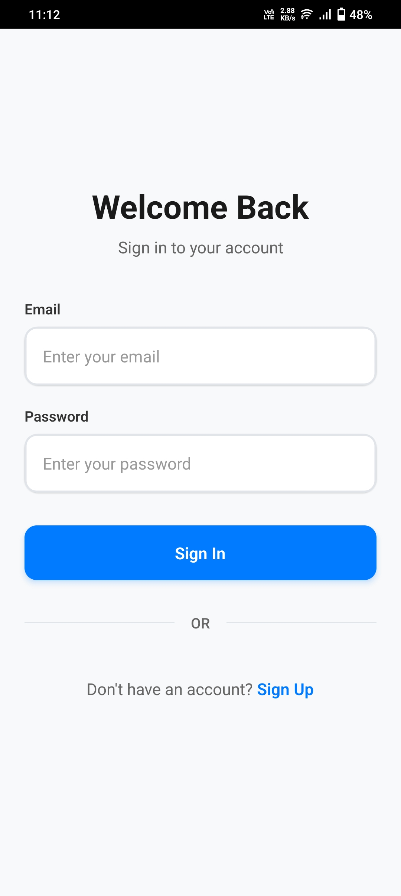
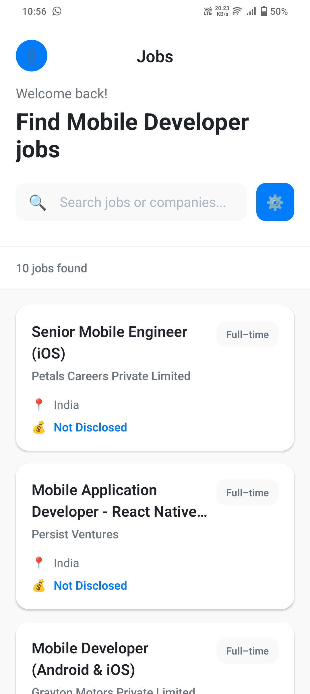
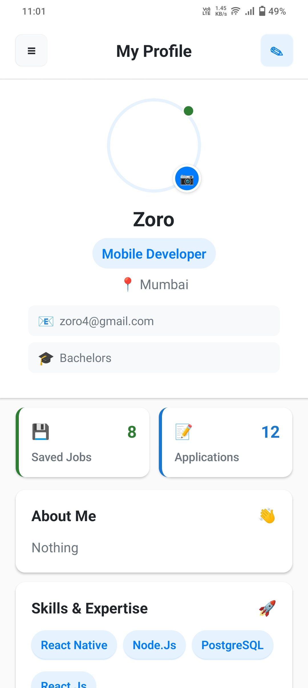

# 💼 JobFinderApp

JobFinderApp is a cross-platform React Native application built using **Expo**, designed to help job seekers find and apply for jobs based on their preferred roles and skills. The app includes Firebase authentication, Firestore for storing user profiles and job data, and Redux for state management.

## 🚀 Features

- 🔐 **User Authentication** (Firebase Auth)
- 👤 **Profile Setup & Editing**
- 📄 **View Job Listings**
- 🔍 **Search Jobs by Preferred Role**
- 📌 **Save/Bookmark Jobs**
- 🧠 **State Management with Redux**
- 🧾 **Clean & Responsive UI**

## 📱 Screens

- **Login/Register**
- **Profile Setup**
- **Home (Job Listings)**
- **Job Details**
- **Saved Jobs**
- **Profile View/Edit**

## 🔧 Tech Stack

- **React Native (Expo)**
- **Firebase Auth + Firestore**
- **Redux Toolkit**
- **React Navigation**
- **Axios** for API calls
- **Vector Icons** for UI enhancement

## 🗂️ Folder Structure

```
JobFinderApp/
├── assets/
├── components/
│ └── JobCard.js
├── constants/
│ ├── colors.js
│ └── sizes.js
├── navigation/
│ └── AppNavigator.js
├── redux/
│ ├── store.js
│ └── userSlice.js
├── screens/
│ ├── HomeScreen.js
│ ├── JobInfoScreen.js
│ ├── LoginScreen.js
│ ├── ProfileScreen.js
│ ├── ProfileSetupScreen.js
│ └── SavedJobsScreen.js
├── firebase.js
├── App.js
└── README.md
```

---

### 🔐 Login 

<p float="left">
  
</p>

---

### 🏠 Home 

<p float="left">
  
</p>

---

### ℹ️ Info 

<p float="left">
  
</p>

---

### 👤 Profile 

<p float="left">
  
</p>

---

### 🔖 Bookmarks 

<p float="left">
  
</p>

---

## 🧪 Setup Instructions

1. **Clone the repository:**

```bash
git clone https://github.com/yourusername/JobFinderApp.git
cd JobFinderApp
